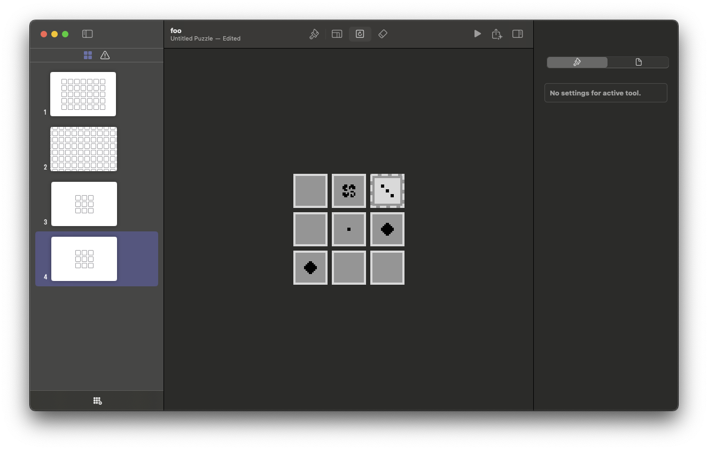

# Grids

Create and edit Taiji puzzles for What the Taiji?! on your Mac.

**Grids** is a free puzzle editor for the Mac that lets you create and edit
puzzles in the style/mechanics of [Taiji](https://taiji-game.com), saved as
[What the Taiji?!](https://marquiskurt.itch.io/what-the-taiji) puzzle files.

**Features**  
- Create and manage multiple puzzles together in a single set.
- Adjust the layout of the grid with the Layout Editor.
- Paint, flip, and erase tiles easily.
- Preview your puzzle in a small player.
- Quickly share puzzles with friends.

## Build from source

**Requirements**  
- macOS Sequoia (15.0) or later
- Xcode 16.2 or later

Start by cloning this repository with `git clone`, then open the Grids.xcodeproj
file on your Mac. Finally, select the "Grids" target and run the project.

## License

Grids is free and open-source software licensed under the MIT License.

### Credits

> **Note**  
> For the most up-to-date credits information, refer to the Credits.rtf file
> listed in this project's resources.

Taiji and the Taiji puzzle mechanics were created by Matthew VanDevander.

The Grids icon was created by VegasOs.

Grids was made possible thanks to the following open-source software:

- **PuzzleKit**: Marquis Kurt - MIT License

Special thanks to these amazing people:
- Grant Neufeld
- femialiu
- joeisanerd
- 2DArray
- rae
- Paul Straw
- Doge4ever05
- Matthew VanDevander